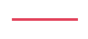

> Casos confirmados de covid19 en Bolivia por municipio, de acuerdo a [esta visualización](https://datosagt2020.carto.com/builder/c1cdf57c-a007-4f3f-883a-c25ebdc50986/embed) mantenida por agetic datos

_Actualizado el 2020/05/08 con datos hasta el 2020/05/06_

Ordenados por el número de casos en la última semana.

| Departamento   | Municipio               |   Confirmados |   Último Día |   Desde 2020-05-03 | Riesgo   |   Índice |   Población |   % Infectado | Tendencia                                      |
|----------------|-------------------------|---------------|--------------|--------------------|----------|----------|-------------|---------------|------------------------------------------------|
| Santa Cruz     | Santa Cruz de la Sierra |           628 |           63 |                113 | ALTO     |    0.655 |     1722480 |         0.036 |  |
| Santa Cruz     | Montero                 |           273 |           22 |                 34 | ALTO     |    0.361 |      135931 |         0.201 |                  |
| La Paz         | La Paz                  |           141 |           10 |                 12 | ALTO     |    0.669 |      816044 |         0.017 |                   |
| Santa Cruz     | La Guardia              |            58 |            7 |                 11 | ALTO     |    0.661 |      177735 |         0.033 |               |
| Santa Cruz     | Warnes                  |            27 |            5 |                  7 | ALTO     |    0.702 |      214246 |         0.013 |                   |
| Potosí         | Potosi                  |            29 |            0 |                  7 | ALTO     |    0.811 |      220260 |         0.013 |                   |
| Santa Cruz     | Mineros                 |            12 |            0 |                  2 | ALTO     |    0.702 |       27261 |         0.044 |                  |
| Santa Cruz     | San Julián              |             3 |            2 |                  2 | ALTO     |    0.752 |       67701 |         0.004 |               |
| Santa Cruz     | Mairana                 |             3 |            2 |                  2 | ALTO     |    0.764 |       13197 |         0.023 |                  |
| Santa Cruz     | Cabezas                 |             2 |            0 |                  2 | MEDIO    |    0.925 |       31942 |         0.006 |                  |
| Tarija         | Tarija                  |             5 |            2 |                  2 | ALTO     |    0.771 |      268387 |         0.002 |                   |
| Santa Cruz     | El Torno                |            13 |            0 |                  2 | ALTO     |    0.684 |       63298 |         0.021 |                 |
| Chuquisaca     | Sucre                   |             6 |            1 |                  2 | ALTO     |    0.898 |      295476 |         0.002 |                    |
| Potosí         | Uyuni                   |             3 |            2 |                  2 | ALTO     |    0.856 |       39494 |         0.008 |                    |
| Oruro          | Oruro                   |            80 |            2 |                  2 | ALTO     |    0.713 |      302643 |         0.026 |                    |
| Santa Cruz     | Robore                  |             6 |            1 |                  1 | ALTO     |    0.695 |       16308 |         0.037 |                   |
| Cochabamba     | Colcapirhua             |             2 |            0 |                  1 | ALTO     |    0.737 |       59172 |         0.003 |              |
| Santa Cruz     | Moro Moro               |             1 |            1 |                  1 | MEDIO    |    0.911 |        2541 |         0.039 |                |
| Santa Cruz     | Puerto Suarez           |             1 |            0 |                  1 | MEDIO    |    0.924 |       24409 |         0.004 |            |
| Tarija         | Yacuiba                 |             1 |            0 |                  1 | ALTO     |    0.892 |      103723 |         0.001 |                  |
| Santa Cruz     | Samaipata               |             1 |            1 |                  1 | MEDIO    |    0.916 |       11731 |         0.009 |                |
| La Paz         | Achacachi               |             1 |            0 |                  0 | ALTO     |    0.756 |       47186 |         0.002 |                |
| La Paz         | Copacabana              |             1 |            0 |                  0 | ALTO     |    0.743 |       15374 |         0.007 |               |
| Santa Cruz     | San Pedro               |             1 |            0 |                  0 | ALTO     |    0.776 |       24077 |         0.004 |                |
| Cochabamba     | Capinota                |             0 |            0 |                  0 | MEDIO    |    0.926 |       21644 |         0.000 |                 |
| La Paz         | Viacha                  |             1 |            0 |                  0 | ALTO     |    0.707 |       90880 |         0.001 |                   |
| Santa Cruz     | Porongo (Ayacucho)      |             1 |            0 |                  0 | ALTO     |    0.707 |       17047 |         0.006 |       |
| La Paz         | Chulumani               |             1 |           -1 |                  0 | ALTO     |    0.758 |       21619 |         0.005 |                |
| Beni           | Guayaramerin            |             1 |            0 |                  0 | ALTO     |    0.620 |       44446 |         0.002 |             |
| Cochabamba     | Omereque                |             5 |            0 |                  0 | ALTO     |    0.612 |        5850 |         0.085 |                 |
| Santa Cruz     | Concepcion              |             1 |            0 |                  0 | ALTO     |    0.774 |       24070 |         0.004 |               |
| Cochabamba     | Chimore                 |             1 |            0 |                  0 | ALTO     |    0.799 |       26855 |         0.004 |                  |
| Cochabamba     | Vinto                   |             1 |            0 |                  0 | ALTO     |    0.738 |       62131 |         0.002 |                    |
| Cochabamba     | Cliza                   |             1 |            0 |                  0 | ALTO     |    0.702 |       23987 |         0.004 |                    |
| Santa Cruz     | Buena Vista             |             1 |            0 |                  0 | ALTO     |    0.761 |       13184 |         0.008 |              |
| La Paz         | Laja                    |             1 |            0 |                  0 | ALTO     |    0.695 |       26225 |         0.004 |                     |
| Oruro          | Eucaliptus              |             9 |            0 |                  0 | ALTO     |    0.355 |        4972 |         0.181 |               |
| La Paz         | El Alto                 |            71 |            0 |                  0 | ALTO     |    0.694 |      943558 |         0.008 |                  |
| Cochabamba     | Cochabamba              |            30 |            0 |                  0 | ALTO     |    0.726 |      724126 |         0.004 |               |
| La Paz         | Patacamaya              |            23 |            0 |                  0 | ALTO     |    0.549 |       23665 |         0.097 |               |
| Oruro          | Huanuni                 |            21 |            0 |                  0 | ALTO     |    0.637 |       27975 |         0.075 |                  |
| Cochabamba     | Quillacollo             |            18 |            0 |                  0 | ALTO     |    0.714 |      169360 |         0.011 |              |
| Santa Cruz     | Santa Rosa              |            16 |            0 |                  0 | ALTO     |    0.632 |       23834 |         0.067 |               |
| Cochabamba     | Santibañez              |            12 |            0 |                  0 | ALTO     |    0.419 |        7295 |         0.164 |               |
| Pando          | Cobija                  |            12 |            0 |                  0 | ALTO     |    0.710 |       78555 |         0.015 |                   |
| La Paz         | Cairoma                 |            12 |            0 |                  0 | ALTO     |    0.522 |       10870 |         0.110 |                  |
| Cochabamba     | Punata                  |             9 |            0 |                  0 | ALTO     |    0.724 |       33011 |         0.027 |                   |
| Santa Cruz     | Cotoca                  |             8 |            0 |                  0 | ALTO     |    0.693 |       54851 |         0.015 |                   |
| La Paz         | Malla                   |             1 |            0 |                  0 | ALTO     |    0.732 |        6195 |         0.016 |                    |
| Santa Cruz     | Vallegrande             |             8 |            0 |                  0 | ALTO     |    0.675 |       18472 |         0.043 |              |
| Santa Cruz     | Pailon                  |             8 |            0 |                  0 | ALTO     |    0.750 |       47473 |         0.017 |                   |
| Santa Cruz     | Genreal Saavedra        |             5 |            0 |                  0 | ALTO     |    0.703 |       14065 |         0.036 |         |
| Santa Cruz     | Portachuelo             |             3 |            0 |                  0 | ALTO     |    0.745 |       19735 |         0.015 |              |
| Cochabamba     | Sacaba                  |             3 |            0 |                  0 | ALTO     |    0.738 |      208913 |         0.001 |                   |
| Oruro          | Santuario de Quillacas  |             3 |            0 |                  0 | ALTO     |    0.639 |        4474 |         0.067 |   |
| Potosí         | Colcha K                |             3 |            0 |                  0 | ALTO     |    0.818 |       15977 |         0.019 |                 |
| Santa Cruz     | Camiri                  |             2 |            0 |                  0 | ALTO     |    0.767 |       36485 |         0.005 |                   |
| Beni           | Trinidad                |           210 |            0 |                  0 | ALTO     |    0.239 |      130657 |         0.161 |                 |
| Santa Cruz     | San Carlos              |             1 |            0 |                  0 | ALTO     |    0.772 |       23629 |         0.004 |               |
| Beni           | Moxos                   |             1 |            0 |                  0 | ALTO     |    0.615 |       22564 |         0.004 |                    |

---

- Los datos hasta el 30 de abril provienen de esta [otra visualización](https://juliael.carto.com/builder/c70fa175-3e6a-4955-8088-89048c6e6886/embed) de agetic.

- Los índices de riesgo fueron publicados el 7 de mayo por el gobierno en [este pdf](https://www.minsalud.gob.bo/images/Descarga/covid19/Indice_Riesgo_Municipal_070520.pdf)

- Existen muchas irregularidades en los nombres de municipios provistos por la fuente de datos de casos. Por eso prefiero construir un diccionario manual de códigos ine. Eso significa que cuando se registre un caso en un nuevo municipio, las columnas de contexto estarán temporalmente vacías.

- Puedes descargar los datos de la tabla de encima en [este enlace](https://raw.githubusercontent.com/mauforonda/casos-municipios/master/dashboard.csv)